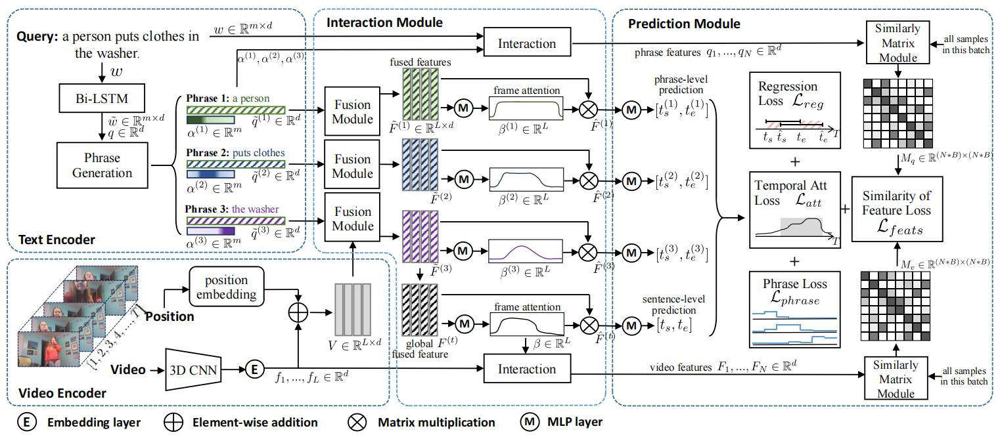

# PLPNet

An implementation of Phrase-level Prediction Net(PLP Net) for temporal sentence localization task using PyTorch. Our paper was accepted by ICMR-2022.

[Sizhe Li](https://sizhelee.github.io/), Chang Li, Minghang Zheng, [Yang Liu](http://www.csyangliu.com/)


An overview of PLPNet method. The model contains four modules, a text encoder to extract sentence
features and generate $N$ phrases, a video encoder to extract visual features with position embedding, an interaction module
where both sentence and phrase features interact with video features, harvesting fused features used in prediction part, and a prediction module to give both sentence-level and phrase-level predictions. We apply the similarity of feature loss, the overall regression loss, temporal attention loss and phrase loss.

## Main Results

### Sentence

Dataset              | R@0.3 | R@0.5 | R@0.7 | mIoU
-------------------- | ------| ------| ------| ------
ActivityNet Captions | 56.92 | 39.20 | 20.91 | 39.53
Charades-STA         | 73.49 | 58.95 | 35.48 | 51.53

### Phrase

Dataset              | R@0.3 | R@0.5 | R@0.7 | mIoU
-------------------- | ------| ------| ------| ------
ActivityNet Captions | 50.10 | 38.12 | 25.24 | 37.96
Charades-STA         | 63.49 | 40.52 | 19.27 | 40.76

### 1. Dependencies

This repository is implemented based on [PyTorch](http://pytorch.org/) with Anaconda.</br>
<!-- Refer to [Setting environment with anaconda](anaconda_environment.md) or use **Docker** (choco1916/envs:temporal_grounding). -->
It relies on python 3.6 and pytorch 1.1.0(other versions may alse work but are not tried).


### 2. Prepare data

Download VGG or I3D features for Charades-STA and put them into the `data/charades/features` folder. Download C3D feature for ActivityNet Captions dataset and put it into the `data/ActivityNet` folder.

### 3. Training models

The code below will load all the data (~30GB for ActivityNet Captions and ~3GB for Charades-STA) into RAM for the fast training, if you want to disable this behavior, set `in_memory` in a config file (`config.yaml`) as `FALSE`.

#### To train on Charades-STA dataset: 

```bash
conda activate tg
# PLPNet model for Charades-STA dataset
bash scripts/train_model.sh LGI tgn_lgi charades 0 4 0
```

The default setting uses I3D feature for training on Charades-STA dateset, if you want to use VGG features, change `feature_type` in a config file (`config.yaml`) as `VGG`.

#### To train on ActivityNet Captions dataset:

```bash
conda activate tg
# PLPNet model for ActivityNet Captions dataset
bash scripts/train_model.sh LGI tgn_lgi anet 0 4 0
```
